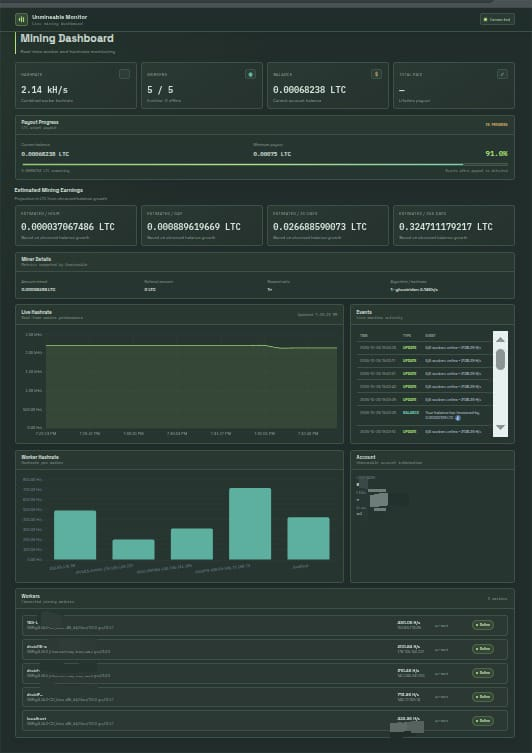

# unminmon
[](ss/overview.jpeg)
## Docker

1. Copy `.env.example` to `.env` and set your Unmineable API key and secret.
2. Start the container with `docker compose up -d --build`.
3. Open `http://localhost:5000` (or the port set by `HOST_PORT`).

Compose uses `restart: unless-stopped`, so Docker restarts the container after a host reboot. On Linux, make sure the Docker service starts on boot with `sudo systemctl enable --now docker`. Do not run `docker compose down` if you want the service to remain configured for automatic restart.

Check logs with `docker compose logs -f unminmon`. Dashboard history and events are held in memory and reset when the container restarts.

## Payout progress

The Unmineable assets API does not include each coin's minimum payout threshold. LTC defaults to the official 0.00075 LTC threshold for its default network. If your payout network uses a different threshold, override it in `.env`:

```dotenv
PAYOUT_MINIMUMS=LTC:<minimum>,DOGE:<minimum>
```

Replace each placeholder with that coin's actual minimum payout amount, then restart the monitor. The dashboard shows progress to the threshold and marks payout complete when the balance drops after reaching 100%.